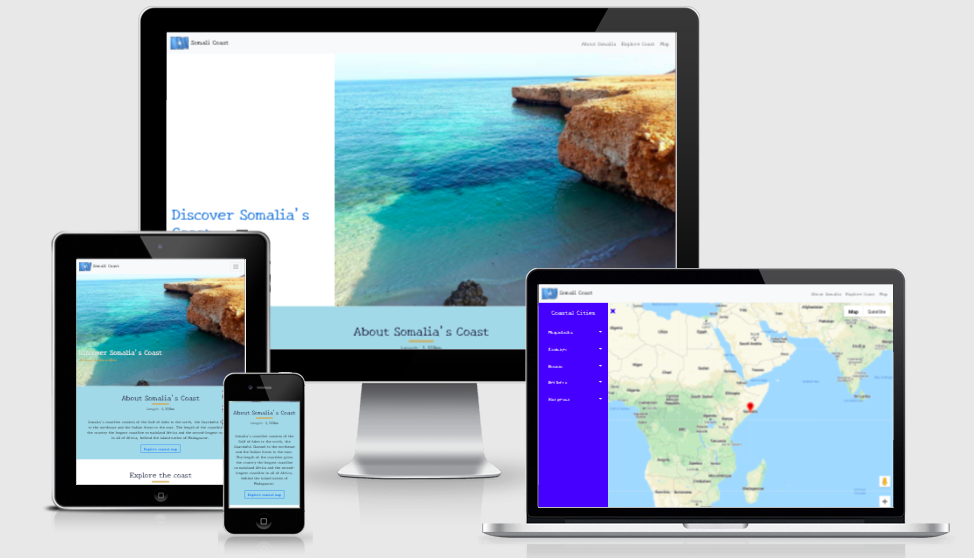

# Coast of Somalia

[**Live Page**](https://zuhur.github.io/milestone-2/)

**Milestone 2 project for Code institute Software Development Programme.** 

A country with the longest coast in the whole of mainland Africa deserves to be showcased. As such, I have assembled a website utilising google maps API. The website consists of a home page displaying information about Somalia's coast and a varitey of images. Should further interest be shown theres a maps page to help navigate through the coastal cities.  
 
## UX
### Strategy
The aim of this website is to showcase Somalia's coast and attract travellers to visit the country by showing different types of beaches and also displaying multiple activities which can be done in the coastal cities. By visiting the website they'll be prompted to visit the country and the website is also equipped with navigating them through the cities should they visit.

#### User Stories
- As a site user, I want to understand the purpose of the website.
- As a site user, I want to easily traverse the website.
- As a site user, I want to see coastal images.
- As a site user, I want to use map to navigate different coastal cities.
- As a site user, I want to use map to see beaches available in coastal cities.
- As a site user, I want to use map to see where I can stay.
- As a site user, I want to use map to see where I can shop.
- As a site user, I want to use map to see what activities are available in the city.

### Scope
At the home page the hero image of the coast will attract the site user and give a brief glimpse to the purpose of the website, with a few scrolls the user should have a firm understanding of the page and be able to traverse the website without thought or prompting.

### Structure
The structure if the website is two-page application with the utlisation of single-page application in the first page. The first page consists of navbar, home page with the hero image, an about section followed by an explore section displaying images as a slider to avoid extensive scrolling. The second page will contain the map page and a personal navigation menu.

### Skeletal
The wireframes were designed using the balsamiq tool for different sections and screen sizes. These can be found below:
*   [Desktop wireframe](assets/wireframes/ms2-wireframes-desktop.pdf)
*   [Mobile wireframe](assets/wireframes/ms2-wireframes-mobile.pdf)
*   [Tablet wireframe](assets/wireframes/ms2-wireframes-tablet.pdf)

### Surface

#### Colors
The main colours used are displayed below from [Coolors](https://coolors.co/) 

#### Fonts
Google fonts:
-   New Tegomin
-   Dancing Script

## Features
 
### Existing Features
- Header - found at the top of the pages and allows user to navigate between pages and also within pages.
- Home page 
    - Discover section: hero image and page heading title
    - About section: Summary about the countries coast, button to navigate to map of Somalia's coast.
    - Explore section: Image carousel with next and previous buttons to slide through the images.
- Map page: Google maps API and a vertical navigation bar with toggle button to hide and show at users request.
- Footer: Copyrights information.

#### Future features
- The country has many undiscovered and unused beaches, in the future as more beaches become available more will be added along with more high quality images.

## Technologies Used

In this section, you should mention all of the languages, frameworks, libraries, and any other tools that you have used to construct this project. For each, provide its name, a link to its official site and a short sentence of why it was used.

-	[HTML5](https://en.wikipedia.org/wiki/HTML5): For structuring of the site.
-	[CSS3](https://en.wikipedia.org/wiki/CSS): For styling of the site.
-   [JavaScript](https://developer.mozilla.org/en-US/docs/Web/JavaScript): For making page interactive.
-	[Bootsrap4](https://getbootstrap.com/docs/5.0/getting-started/introduction/): For fast development of the site and its responsiveness.
-   [Google maps API](https://developers.google.com/maps/documentation/javascript/overview): For displaying map on website.
-	[Fontawesome](https://fontawesome.com/): For visual icons.
-	[Github](https://github.com/): For remote access of the project.
-	[Gitpod](https://www.gitpod.io/): Development environment on the browser.
-	[Git](https://git-scm.com/): For version-control.
-	[Visual Studio Code](https://code.visualstudio.com/): A development environment as an upgrade to gitpod.
-	[Balsamiq](https://balsamiq.com/): For designing wireframes.
-	[Google fonts](https://fonts.google.com/): Styling of the text.
-   [Coolors](https://coolors.co/): For selecting colour palette.

## Testing
### HTML Validation
The validator used was [https://validator.w3.org/](https://validator.w3.org/)
- "Document checking completed. No errors or warnings to show."

### CSS Validation
The CSS validator used was [https://jigsaw.w3.org/css-validator/validator]( https://jigsaw.w3.org/css-validator/validator)
-	17 errors were shown all on Bootstrap5 level
-	Resolved by switiching to Bootsrap4 
-	No error found

### JavaScript Validation
The validator used was [https://jshint.com/](https://jshint.com/)

### Responsiveness
- Google devtools was used to make sure the site is responsive to different devices and screen sizes.
- Chrome extension [Responsive Viewer](https://chrome.google.com/webstore/detail/responsive-viewer/inmopeiepgfljkpkidclfgbgbmfcennb) was also used which shows multiple screens of different sizes at once.

### Manual Test
#### Header
- All links were engaged to make sure they correspond to the right location and page.
- Navbar toggler collapses after clicking a link.

#### About
- Hovering over button transforms correctly and navigates to correct location.

#### Explore coast
- The navigation button for the image sliders correctly take you to the next image or the previous image.

#### Maps
- The vertical navigation toggles correctly when hamburger icon is clicked.
- Clicking the cities places marker on the each city.
- Clicking the activity places marker accordingly. 
- Navbar is also scrollable when all activities for each city are visible.

## Deployment

#### Fork
1. Navigate to [repository](https://github.com/Zuhur/milestone-2)
2. Click fork in the top right corner.

Follow this [link]( https://docs.github.com/en/github/getting-started-with-github/fork-a-repo) on how to fork a repository.

#### Clone Repository (Local copy)
1. Navigate to [repository](https://github.com/Zuhur/milestone-2).
2. Click Code located over the files.
3. Select how you want to create the local repo.
4. Copy the url.
5. Open Terminal.
6. Change directory to where you want the repo to be.
7. type "git clone" followed by the url copied in step 4.
8. Enter, and a Local repo is created.

Follow this [link](https://docs.github.com/en/github/creating-cloning-and-archiving-repositories/cloning-a-repository) on how to clone a repository.

#### Deploy
1.	Open this repository on Github [https://github.com/Zuhur/milestone-2]( https://github.com/Zuhur/milestone-2).
2.	Go to settings .
3.	Scroll down to GitHub Pages.
4.	Select a branch (master) and then /(root).
5.	Click save. 
6.	Link available when scrolled down to Github Pages.

## Credits

### Content
- For helping with vertical navbar [youtube](https://www.youtube.com/watch?v=O9l75KOB2pE&t=2s)
- For changing the location of map and satellite buttons [Stackoverflow](https://stackoverflow.com/questions/49994769/how-to-change-the-location-of-map-and-satellite-buttons-in-google-maps-api)
- For adding infoWindow to markers on the maps [Google Maps Platform Documentation](https://developers.google.com/maps/documentation/javascript/infowindows)
- For searching locations on the maps [Google Maps Platform Documentation](https://developers.google.com/maps/documentation/javascript/places)
- 

### Media
- Gif: The gif on the header is from https://www.crossed-flag-pins.com/animated-flag-gif/flags-Somalia.html. 
- Images
    - Special permission to use images from - https://www.somger.com/post/top-10-best-beaches-in-somalia-with-photos-map
    - https://commons.wikimedia.org/wiki/File:Ceel_Sheekh,_Somaliland.jpg
    - https://upload.wikimedia.org/wikipedia/commons/0/0a/Coral_refs_in_the_of_shore_area_in_berbera_somalia.jpg 

### Acknowledgements

- Special Thanks to [Mustafa Mmj](https://www.somger.com/post/top-10-best-beaches-in-somalia-with-photos-map) who allowed me to use their images for this project.
